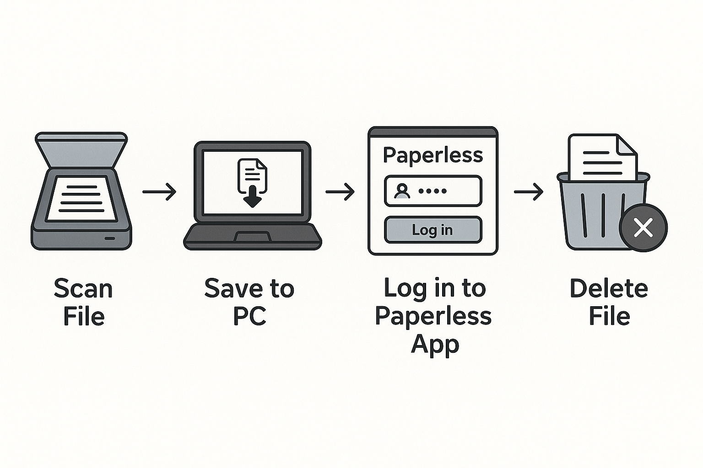
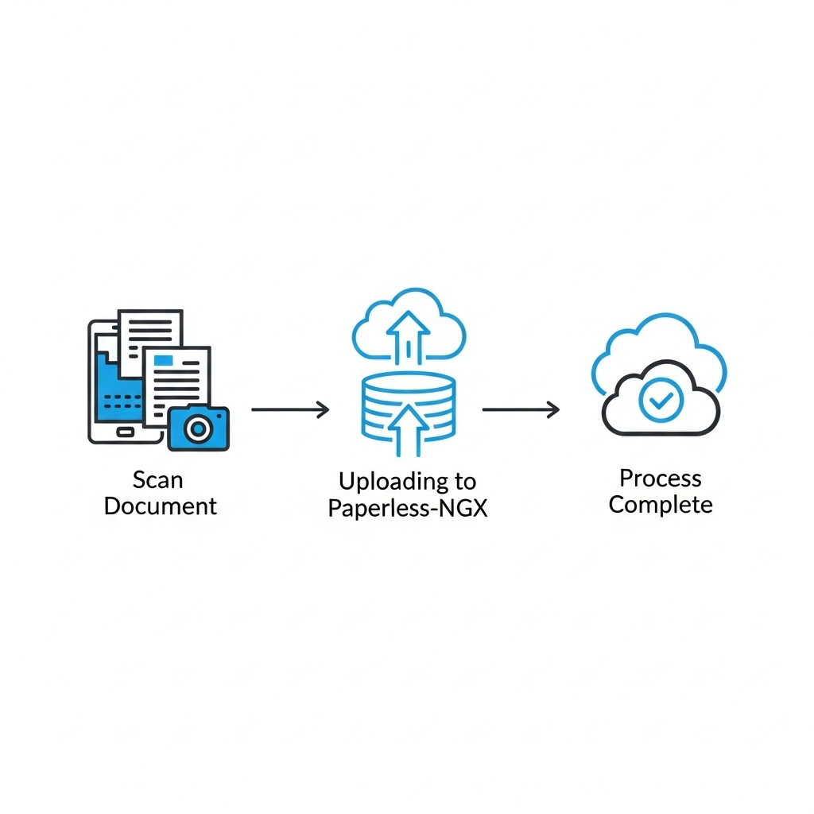
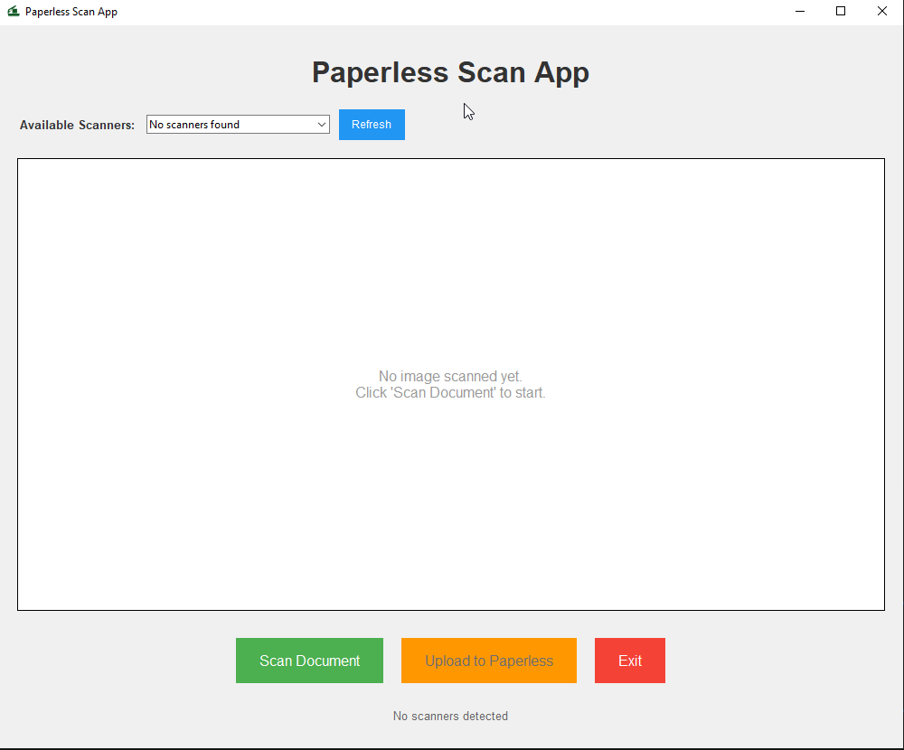
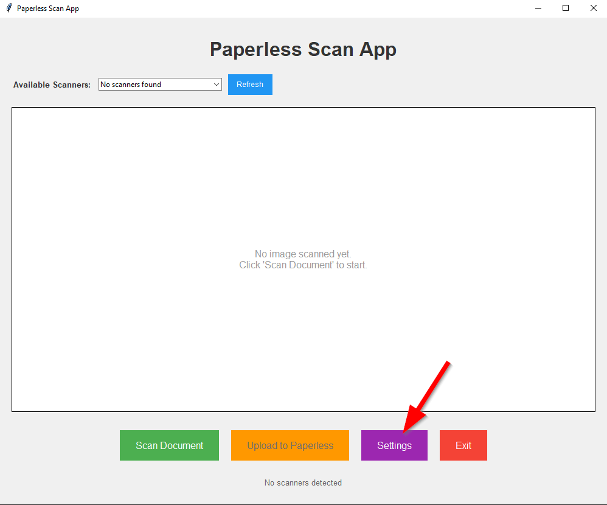
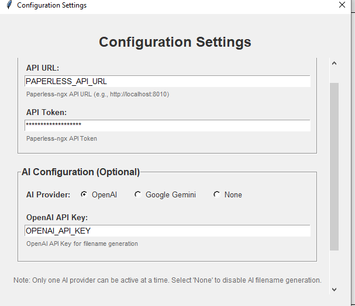

# Paperless Scanner

A desktop application that streamlines the process of scanning documents and uploading them to Paperless-ngx. I got Tired of having to scan papers, then login to paperless, and then upload, and then delete the scanned doc? This app does it all for you in one seamless workflow.

## Before:


## After


## Features

- **One-Click Scanning**: Scan documents directly from your scanner with a simple button click
- **Smart Filename Suggestions**: AI-powered filename recommendations based on document content using OpenAI's GPT-4o-mini or Google's Gemini
- **Direct Paperless Integration**: Upload scanned documents directly to Paperless-ngx with proper metadata
- **Modern GUI**: Clean, intuitive interface built with tkinter
- **Scanner Detection**: Automatic detection and management of available scanners
- **Configurable**: Easy configuration through YAML files

## Screenshots



## Installation

### Prerequisites

- Python 3.8 or higher
- Windows OS (for scanner support)
- A scanner connected to your computer
- Paperless-ngx instance running
- OpenAI API key (optional, for smart filename suggestions)
- Google Gemini API key (optional, for alternative smart filename suggestions)

### Setup

1. **Get your Paperless API token**:
   - Log into your Paperless-ngx instance
   - Go to Settings → Users → Your User → API Tokens
   - Create a new token with appropriate permissions

2. **Configure the settings**
   - 
   - 

## Supported Scanners
This should support most scanners that work on windows.. but here is a list that was tested against.

### Brother
- DS940DW
- DS640
- RDS740D
### Epson
- ES50
### HP
- HPPS200

## Usage

### Basic Workflow

1. **Launch the application**:
   ```bash
   python app.py
   ```

2. **Select your scanner** (if multiple are available)

3. **Click "Scan Document"** to scan your document

4. **Enter a filename** or use the AI-suggested filename

5. **Click "Save"** to save the document locally

6. **Click "Upload to Paperless"** to upload to your Paperless-ngx instance

### Build the app
``` pyinstaller app.py -n paperless-scanner --icon icon.ico  ```

Create config.yaml (or just move it into directory)

### AI-Powered Filename Suggestions

The application can automatically suggest filenames based on the document content using either OpenAI or Google Gemini:

- After scanning, the AI will analyze the document and suggest a descriptive filename
- You can accept the suggestion or enter your own filename
- Filenames are automatically cleaned (spaces replaced with underscores, invalid characters removed)
- Supports both OpenAI GPT-4o-mini and Google Gemini 2.5 Pro models

### Configuration Options

#### Paperless-ngx Configuration
- `api_url`: Your Paperless-ngx instance URL
   - make sure to add http or https 
- `api_token`: Your Paperless API token
   - profile > API Auth Token

#### AI Configuration (Optional) Choose 1
- `openai_api_key`: Your OpenAI API key
   - This can be gotten via openapi.com. Note: the keys can only be displayed once
- `gemini_api_key`: Your Google Gemini API key

## File Structure

```
scanner/
├── app.py              # Main GUI application
├── scanner.py          # Scanner and Paperless integration
├── ai.py              # AI-powered filename suggestions
├── config.yaml        # Configuration file
├── requirements.txt   # Python dependencies
├── README.md         # This file
└── License.md        # License information
```

## API Integration

### Paperless-ngx API
The application integrates with Paperless-ngx using its REST API:

### AI APIs (Optional)
For smart filename suggestions:

**OpenAI API**:
- Uses GPT-4o-mini for document analysis

**Google Gemini API**:
- Uses Gemini 2.5 Pro for document analysis


## Troubleshooting

### Common Issues

**Scanner not detected**:
- Ensure your scanner is connected and powered on
- Check that WIA drivers are properly installed
- Try refreshing the scanner list

**Upload fails**:
- Verify your Paperless-ngx URL and API token
- Check that your Paperless instance is accessible
- Ensure the API token has proper permissions

**AI suggestions not working**:
- Verify your OpenAI API key is correct (for OpenAI)
- Verify your Google Gemini API key is correct (for Gemini)
- Check your internet connection
- Ensure you have sufficient API credits for your chosen provider (or switch from google to openai or vice versa if running out of credits.)

### Contributing

1. Fork the repository
2. Create a feature branch
3. Make your changes
4. Test thoroughly, run unit tests
5. Submit a pull request

## License

Released under GPL v3. See [License.md](License.md) for details.

## Acknowledgments
- Stackoverflow for bunch of stuff
- https://github.com/soachishti/pyScanLib for some guidance